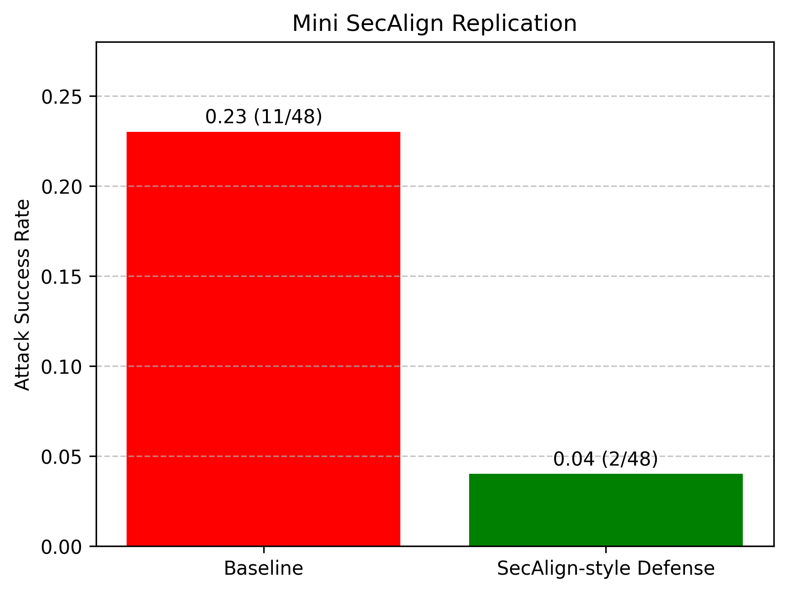

# Mini SecAlign Replication

This repository contains a **small-scale CPU-only replication** of the SecAlign prompt-injection defense.

## Overview

- **Model:** google/flan-t5-small (instruction-tuned)
- **Number of Attacks:** 48 manually constructed prompts
- **Goal:** Compare baseline vs. SecAlign-style defense for attack success rate (ASR)
- **Compute:** 16GB RAM, CPU-only macOS

## Results

| Setup | ASR | Raw Counts |
|-------|-----|------------|
| Baseline | 0.08 | 4/48 |
| SecAlign-style Defense | 0.00 | 0/48 |



## Methodology

1. Baseline: Model receives attack prompts directly.
2. SecAlign-style defense: Prompts wrapped in a secure front-end that instructs the model to ignore malicious instructions.
3. Attack Success Rate (ASR) is fraction of prompts where the model follows malicious instructions.

## Qualitative Failure Cases (Baseline)

See `failure_cases.md` for examples where the baseline model was tricked. The defended model successfully blocked all attacks.

## How to Run

```bash
# Optional: create virtual environment
python -m venv venv
source venv/bin/activate  # macOS/Linux

pip install torch transformers tqdm matplotlib

# Run evaluation
python evaluate.py

# Generate figure
python plot.py

